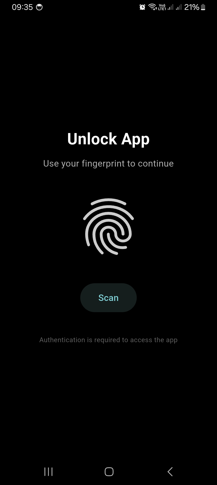
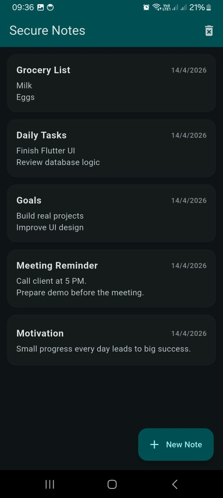
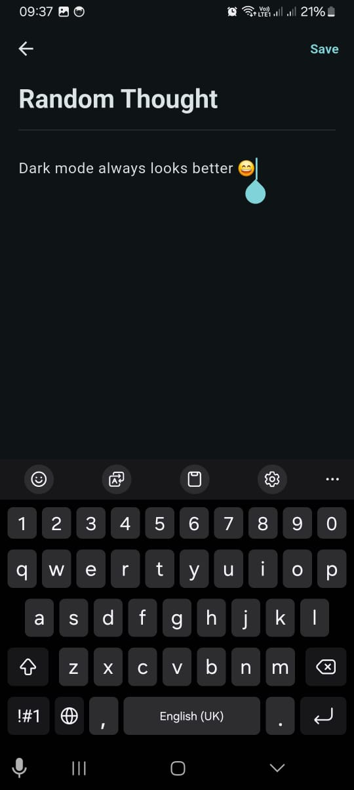
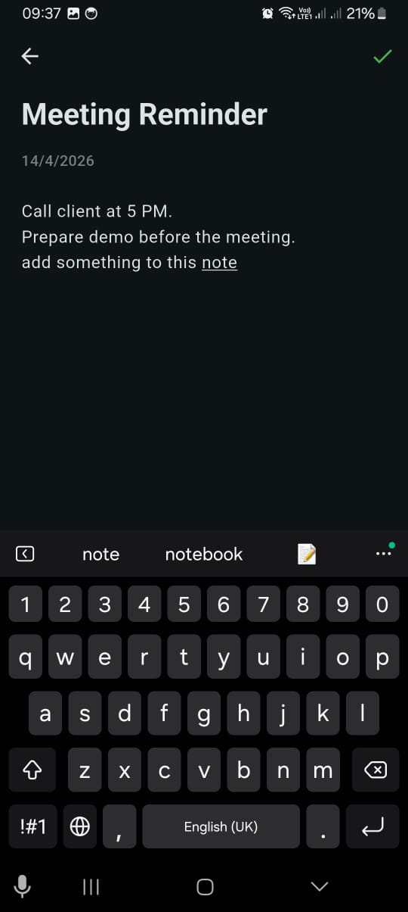
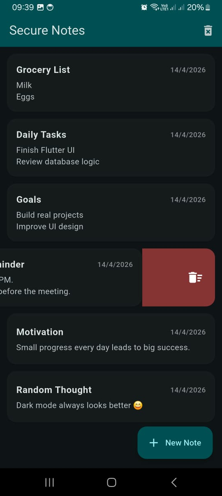
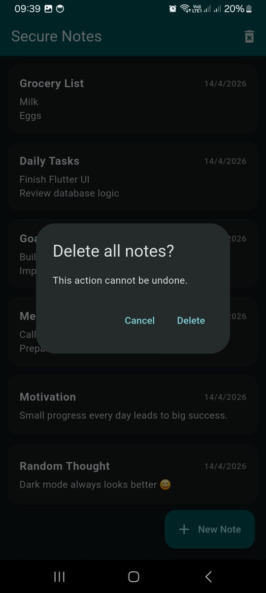

# Secure Notes App

A secure and intuitive note-taking application built with Flutter, featuring biometric authentication and multi-language support.

## Features

*   **Biometric Authentication:** Secure your notes with fingerprint (or face) authentication upon app launch.
*   **Create, Read, Update, Delete (CRUD) Notes:** Easily manage your notes with full CRUD functionality.
*   **Note Reordering:** Organize your notes by dragging and dropping them into your preferred order.
*   **Data Persistence:** All notes are securely stored locally using `sqflite`.
*   **Multi-language Support:** Available in English, French, and Arabic.
*   **Adaptive Theme:** Supports both light and dark themes based on system settings.
*   **Responsive UI:** Designed to work seamlessly across various device sizes.

## Technologies Used

*   **Flutter:** UI toolkit for building natively compiled applications for mobile, web, and desktop from a single codebase.
*   **`sqflite`:** SQLite plugin for Flutter, providing a robust local database solution.
*   **`local_auth`:** Flutter plugin for authenticating users using on-device biometrics (fingerprint, face, etc.) or device passcodes.
*   **`intl`:** Internationalization and localization for Dart.

## Getting Started

### Prerequisites

Make sure you have Flutter installed. If not, follow the official Flutter installation guide: [Flutter Installation Guide](https://flutter.dev/docs/get-started/install)

### Installation

1.  **Clone the repository:**
    ```bash
    git clone https://github.com/your_username/secure_notes.git # Replace with actual repo URL
    cd secure_notes
    ```
2.  **Get dependencies:**
    ```bash
    flutter pub get
    ```
3.  **Run the application:**
    ```bash
    flutter run
    ```

### Running on a specific device (e.g., Android emulator/device with biometrics)

Ensure your emulator or physical device has biometric authentication set up.

1.  **List devices:**
    ```bash
    flutter devices
    ```
2.  **Run on a specific device:**
    ```bash
    flutter run -d <device_id>
    ```

## Usage

1.  **Launch the app:** You will be prompted to authenticate using your fingerprint (or other biometrics).
2.  **Home Screen:** View your list of notes. You can reorder notes by long-pressing and dragging them.
3.  **Add New Note:** Tap the floating action button (`+`) to create a new note.
4.  **View/Edit Note:** Tap on an existing note to view its details or make changes.
5.  **Delete Note:** Swipe a note to the left to delete it. You can also delete all notes from the app bar menu.

## Screenshots

<p align="center">
  
  
  
</p>

<p align="center">
  
  
  
</p>

## Contributing

Feel free to fork the repository, open issues, and submit pull requests.

## License

This project is licensed under the [MIT License](LICENSE).